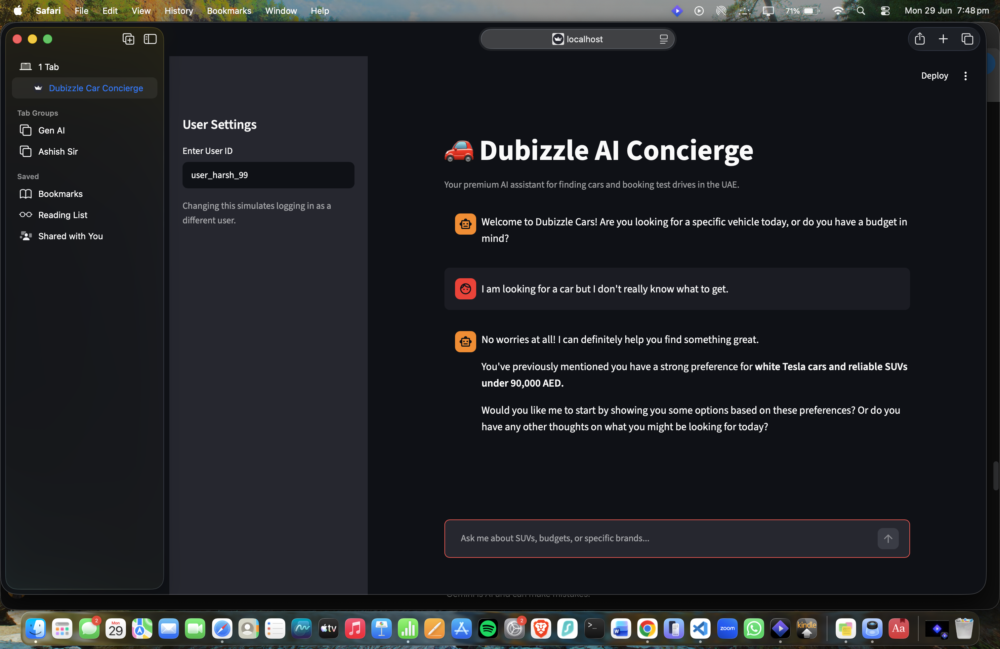

# 🚗 Dubizzle AI Car Concierge

**Author:** Harsh Garg

Hey there! Welcome to my submission for the Dubizzle AI Car Concierge. 

I built this project to be more than just a simple chatbot wrapper. It's a fully functional, multi-turn AI agent that helps users explore the Dubizzle car inventory, securely books test drives, and actually *remembers* who you are and what cars you like if you come back the next day. 

## 📂 What's in the repo?

Here is a quick breakdown of how I structured the project:

```text
├── README.md
├── backend/
│   ├── __init__.py
│   ├── agent.py               # The "Brain": Gemini LLM setup and custom tool-calling logic
│   ├── api.py                 # The "Muscle": Pandas filtering + Vector semantic search
│   ├── main.py                # Unused (leftover from the initial prototyping phase)
│   ├── main1.py               # The FastAPI entry point for the production-style backend
│   └── memory.py              # Handles RAM-based short-term and JSON-based long-term memory
├── data/
│   ├── Copy of sample_cars_dataset.xlsx  # The raw dataset
│   ├── processed_inventory.pkl           # Pre-embedded dataset (speeds up the app)
│   ├── processed_inventory_audit.csv     # Human-readable version of the processed data
│   ├── bookings_db.json                  # Flat-file database for test drive slots
│   └── users_db.json                     # Flat-file database for long-term user profiles
├── frontend/
│   ├── app.py                 # The initial monolithic Streamlit UI (direct imports)
│   └── app1.py                # The final decoupled Streamlit UI (communicates via HTTP)
├── pyproject.toml             # uv dependency configurations
└── scripts/
    ├── preprocess_inventory.py       # Standard regex-based data cleaning pipeline
    └── preprocess_inventory_llm.py   # Advanced LLM-assisted data extraction
```

## 🚀 How to run it

I used `uv` for dependency management because it's blazingly fast. To get started, make sure you have `uv` installed, and drop your `GEMINI_API_KEY` into a `.env` file in the root directory.

Run this to sync the environment:
```bash
uv sync
```

I've included two ways to run the app, depending on how you want to test it.

### Approach 1: The "Modular Monolith" (Rapid Prototyping)
In this version, the Streamlit frontend directly imports the Python backend files. I built this first to eliminate network latency while testing the core AI logic.
```bash
uv run streamlit run frontend/app.py
```

### Approach 2: Client-Server Architecture (Production Mode)
This is the final, production-ready architecture. The backend runs as an isolated FastAPI microservice, and the Streamlit frontend acts as a "dumb client" that just sends and receives JSON over HTTP. 

You'll need two terminals for this:

**Terminal 1 (Start the API):**
```bash
uv run uvicorn backend.main1:app --reload
```
**Terminal 2 (Start the UI):**
```bash
uv run streamlit run frontend/app1.py
```

---

## 🏗️ Why I built it this way (Architectural Choices)

**The Interface (Streamlit vs. Notebooks):** I chose Streamlit over a Jupyter Notebook because I wanted to simulate a real, consumer-facing product. Notebooks are great for data science, but Streamlit's `st.chat_input` and state management let me prove that this backend can smoothly power a live chat interface. By decoupling the frontend in Approach 2, I also proved this backend could just as easily hook into a React Native or iOS app tomorrow.

**The Agent Framework:** I intentionally avoided heavy frameworks like LangChain. Instead, I built a custom, lightweight orchestrator using Gemini's native function-calling. This gave me granular control over the system prompts, avoided token bloat, and made debugging the tool-execution loop much easier. 

**The Search Engine:** I used a **Hybrid Search** approach, and this is probably my favorite feature. LLMs are notoriously bad at math. If I relied purely on vector search, the AI might suggest a 100k AED car to someone with a 50k AED budget just because the semantic description matched. To fix this, my `api.py` uses Pandas to strictly filter out hard constraints (budget, year, make) *first*, and only then applies Cosine Similarity on the embeddings to rank the remaining cars. 

**Memory Management:** I split memory into two tiers. Short-term memory (the active conversation) lives in RAM so the AI can understand pronouns like "Does *it* have a warranty?". Long-term memory (user preferences, liked cars) is extracted via AI tools and saved to flat JSON files. I chose JSON files over a real database simply to make this project easy for you to review and run locally without needing to spin up Docker containers or PostgreSQL servers.

## 🔮 Future Improvements

While this architecture gets the job done well for a prototype, pushing this to millions of Dubizzle users would require a few upgrades. 

First, I would swap out the in-memory Pandas dataframe and JSON files for a proper Vector Database (like Pinecone or Qdrant) and a relational database (PostgreSQL) managed by SQLAlchemy. Second, the manual "User ID" input in the Streamlit sidebar would be replaced by a secure JWT authentication flow. Finally, I would update the FastAPI endpoints to be fully asynchronous (`async def`) to handle high concurrent traffic without blocking the event loop.

---

## 📸 See it in action

### 1. Exploring the Inventory
*(Here is a demonstration of the AI guiding a user through the inventory, applying budget constraints, and formatting the output natively.)*



### 2. Recalling User Preferences
*(Here is a demonstration of a completely new session where the AI recognizes the returning user ID and remembers exactly what they were looking for yesterday.)*

